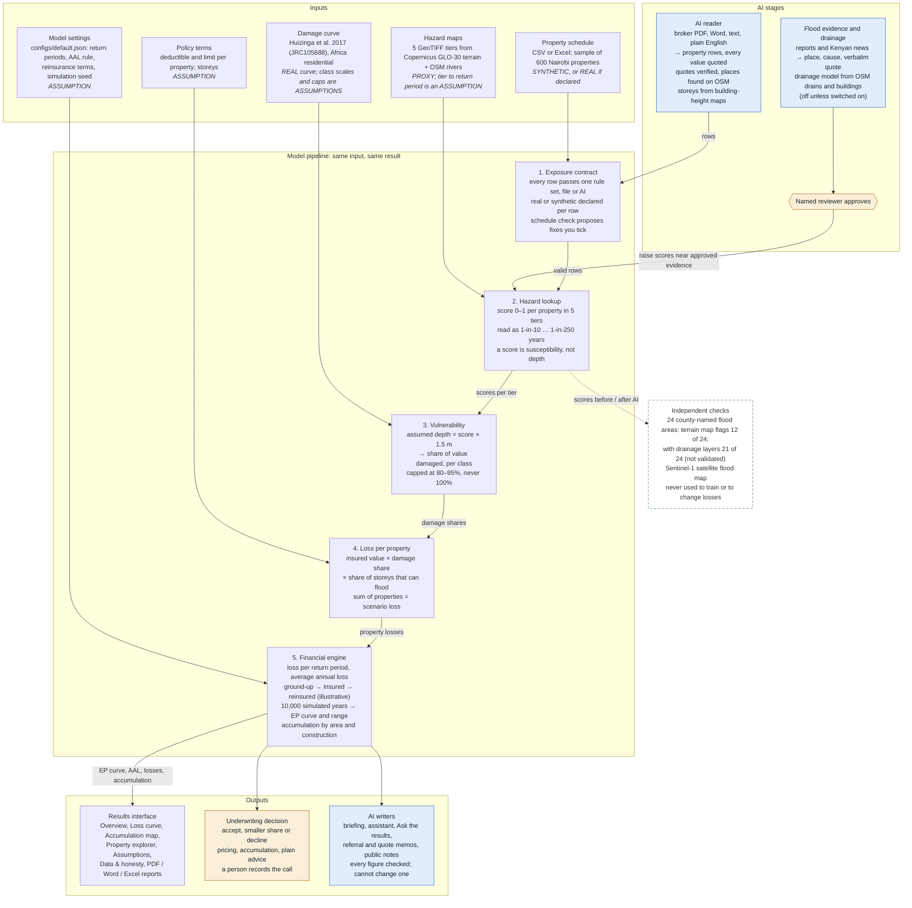
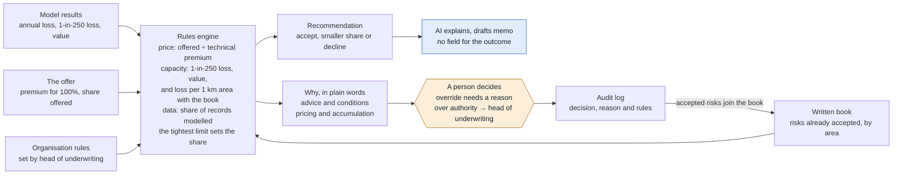

# Xpat solution flow, from input to decision

How a property list becomes a flood loss curve and an underwriting decision, where AI enters, what it is allowed to
change, and how each step is checked. Every step below exists in the code (`src/floodcat`, `app/`).

Legend for the diagrams: plain boxes are fixed model steps, **blue** boxes are AI stages, **amber** marks a decision a
person makes, and **dotted** lines are independent checks that never change a loss.

## 1. The end-to-end flow

AI feeds only two stages. It turns documents into property rows (stage 1) and, after a named reviewer approves the
evidence, raises hazard near drainage problems (stage 2). Stages 3 to 5 take no AI input: AI may never set a depth, a
damage share or a loss. The dotted checks compare the hazard with real places and satellite data but never change a loss.

## 2. From results to an underwriting decision

The recommendation comes from fixed rules, so the same offer always gives the same answer. AI can explain it or draft a
referral or quote letter, but its output has no field for the outcome or share. The decision a person records is
checked against the rules again on the server, and accepted risks count against the next decision in the same area.

## 3. Where AI is used, and how it is held to account

AI runs on Google Gemini or a local Llama model, chosen by each person within their organisation's rules. When the
organisation keeps client data on its own server, documents and real results only ever go to the local model.

| AI stage | Goes in | What AI does | Checked by | Changes the numbers? |
|---|---|---|---|---|
| AI reader | Broker PDF, Word, text, plain English | Turns text into property rows, one verbatim quote per value | Quote must appear in the source; places located on OpenStreetMap; same validation as a CSV; a person reviews every row | **Yes:** decides what is modelled |
| Flood evidence | Flood reports, Kenyan news (GDELT) | Extracts place, cause and a verbatim quote | Quote check; independence from the county list flagged; a named reviewer approves before anything changes | **Yes:** raises hazard near approved drainage evidence. Demo: AAL KES 125.9 m → 139.6 m |
| Drainage model | OSM drains, culverts, buildings | Drainage-failure probability per place | Never trained on the 24 named areas; hit rate reported in the same terms (12 → 21 of 24) | **Only when switched on** |
| Building storeys | Open Buildings height map | Proposes storey counts where blank | A person accepts each one; normal validation | **Yes:** only lower floors flood |
| Schedule check | Flags from fixed data checks | Explains each problem and suggests a question for the broker | No field for a value or fix; figures checked | No |
| Writers | The run's fact pack and Xpat's documentation | Briefing, assistant, memos, public notes in English and Kiswahili | Every number checked against the facts; sources cited; untraceable figures flagged | No |

## 4. What comes out, for the sample portfolio

Labels: SYNTHETIC portfolio · PROXY hazard · ASSUMED return periods.

| Measure | Value | Plain English |
|---|---|---|
| Insured value | KES 63.64 bn | 600 synthetic properties |
| 1-in-100 year loss | KES 1.70 bn | 2.67% of value; an assumed 1% chance each year of a loss at least this large |
| 1-in-250 year loss | KES 2.65 bn | 4.16% of value; an assumed 0.4% chance each year |
| Average annual loss | KES 125.9 m | long-run yearly average implied by the curve |

Ground-up figures from `outputs/nairobi_day1_results.md` (generated 8 October 2026). Illustrative only: nothing is
calibrated to Kenyan claims.

## 5. Safeguards on every path

- E-mail addresses and phone numbers are removed before any text reaches an AI model, and people consent each time.
- AI output is treated as untrusted data: re-checked by fixed code, never allowed to set a depth, damage share or loss.
- Every number shows where it came from: REAL, PROXY, SYNTHETIC, ASSUMPTION or AI.
- Every change and AI call is written to the organisation's audit log, with the model used.
- The hazard map flags 12 of the 24 county-named flood areas on its own. This limit is stated on every results page.
